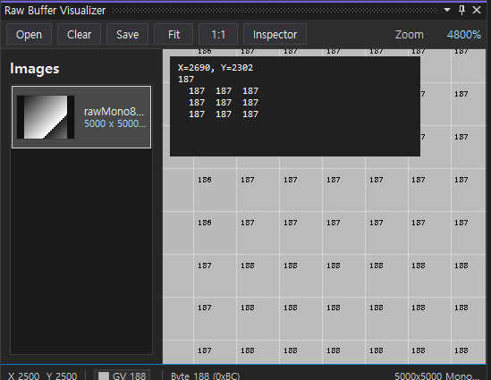
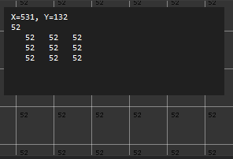
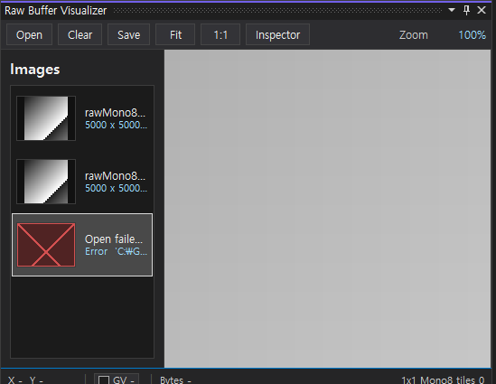
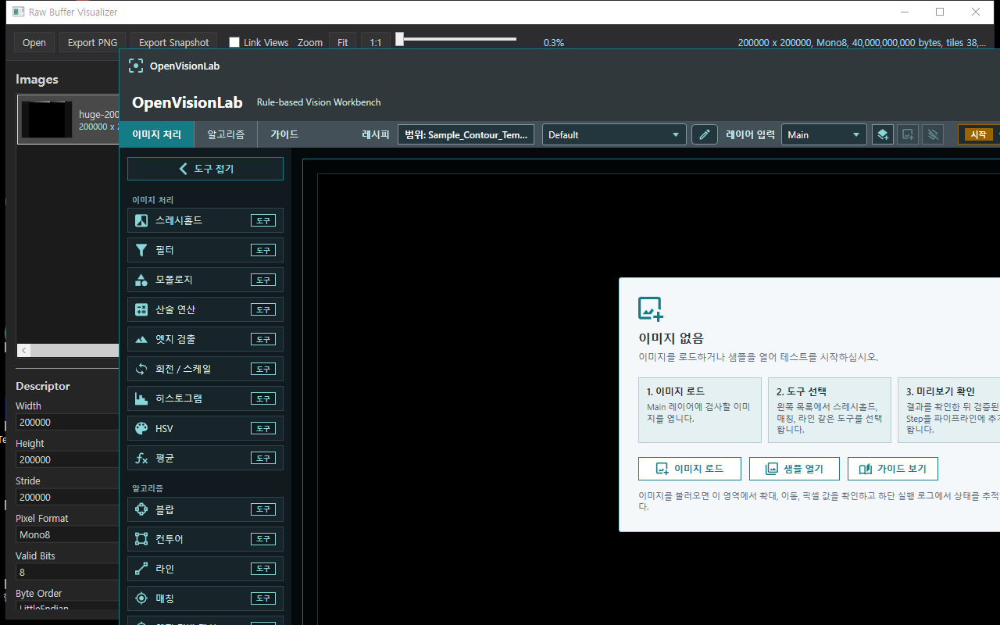

# Raw Buffer Visualizer

[](https://github.com/Noah8218/RawBufferVisualizer/actions/workflows/ci.yml)

Raw Buffer Visualizer is an Image Watch style debugger visualizer for C# machine-vision developers. It lets you inspect raw image memory, `System.Drawing.Bitmap`, OpenCvSharp `Mat`, Emgu CV `Mat`, and pointer-backed image views directly inside Visual Studio.

The viewer is built around the workflow machine-vision developers use every day:

1. Stop at a breakpoint.
2. Click the debugger visualizer icon on an image variable.
3. Keep every inspected image in one docked `Raw Buffer Visualizer` window.
4. Compare thumbnails, dimensions, stride, type, and pixel format.
5. Pan, zoom, inspect pixels, check raw bytes, and diagnose buffer interpretation issues.



## Key Features

- Single docked Visual Studio window where inspected images accumulate in an `Images` list.
- Image rows include variable/title, thumbnail, width x height, pixel format, stride, and source type.
- Failed opens stay visible as error rows with the reason, instead of disappearing silently.
- Pixel status strip with X/Y, GV or RGB channel values, color swatches, and source bytes.
- High-zoom pixel grid overlay for reading values directly on the image.
- Save the current visible view as PNG, or save a raw `.rbuf.json` snapshot from the image list context menu.
- 5x5 neighborhood, ROI 5x5 statistics, pinned marker, line profile, histogram, diagnostics, and render levels.
- Try interpretation controls for changing pixel format, stride, valid bits, and byte order while debugging.
- A/B comparison MVP: set A/B, link pan/zoom, split view, diff view, and blink compare.
- File-backed tiled display for very large raw payloads.



## Install

### Visual Studio extension

Build or download `RawBufferVisualizer.VisualStudio.Extensibility.vsix`, then install that single VSIX. It contains both the debugger visualizers and the docked Visual Studio image inspector.

For local development builds:

```powershell
powershell -ExecutionPolicy Bypass -File .\scripts\Install-VisualStudioExtension.ps1 -Configuration Release -Framework net472 -ViewerFramework net472 -Reinstall
```

Restart Visual Studio after installation or update.

### Standalone viewer

Build the WPF viewer or download the Windows package from GitHub Releases once a release is published.

```powershell
dotnet build .\RawBufferVisualizer.sln -c Release
dotnet run --project .\src\RawBufferVisualizer.Wpf\RawBufferVisualizer.Wpf.csproj -f net9.0-windows -- .\artifacts\samples\mono8-gradient.rbuf.json
```

The standalone viewer opens `.rbuf.json` snapshot files and is useful for saved samples, large-image validation, and screenshots.

## Visual Studio Usage

1. Install `RawBufferVisualizer.VisualStudio.Extensibility.vsix`.
2. Start debugging a C# project in Visual Studio.
3. Stop at a breakpoint where a supported image variable is alive.
4. In DataTip, Watch, Locals, or Autos, click the visualizer icon.
5. The image is appended to the docked `Raw Buffer Visualizer` window.
6. Use the `Images` list to switch between captured variables.
7. Use mouse wheel for zoom and mouse drag for pan.
8. Use the status strip and Inspector for pixel values, raw bytes, ROI, marker, diagnostics, levels, interpretation, and comparison.
9. Use `Save` to export the current visible view as PNG. Right-click an image row to save the raw snapshot.

The toolbar intentionally stays small: `Open`, `Clear`, `Save`, `Fit`, `1:1`, `Inspector`, and `Link Views` when there is room. Detailed debugging controls stay in the Inspector or compact docked inspector so the Visual Studio workflow remains focused.



## Supported Inputs

| Input | Status | Notes |
| --- | --- | --- |
| `RawBufferSnapshot` | Supported | SDK snapshot from `byte[]`, `ushort[]`, `float[]`, or `IntPtr`. |
| `RawBufferView` | Supported | Pointer-backed wrapper for common camera/frame-grabber image shapes. |
| `System.Drawing.Bitmap` | Supported | 8bpp indexed, 24bpp RGB, and 32bpp RGB/ARGB/PARGB mappings. |
| OpenCvSharp `Mat` | Supported | Common 8-bit, 16-bit, and 32-bit float Mat formats. |
| Emgu CV `Mat` | Supported | Extracted by reflection, so the extension does not require a direct Emgu dependency. |
| `.rbuf.json` + `.raw` | Supported | Snapshot metadata plus raw payload. |
| `.raw` / `.bin` only | Limited | Create a matching `.rbuf.json` descriptor first. |

Industrial camera and frame-grabber SDK objects are best supported through a common shape adapter first. If your object exposes buffer pointer, width, height, stride, channels, bit depth, and pixel format, wrap it as `RawBufferView`.

```csharp
var view = new RawBufferView
{
    Buffer = imagePointer,
    BufferLength = stride * height,
    Width = width,
    Height = height,
    Stride = stride,
    PixelFormat = RawPixelFormat.BGR24,
    Channels = 3,
    BitDepth = 8,
    ByteOrder = RawByteOrder.LittleEndian,
    Name = "camera0"
};
```

Inspect `view` directly from Visual Studio after the VSIX is installed.

## Supported Pixel Formats

| Format | Storage | Valid Bits | Display |
| --- | ---: | ---: | --- |
| `Mono8` | 1 byte / pixel | 8 | Grayscale |
| `Mono16` | 2 bytes / pixel | 1-16 | Grayscale with levels |
| `Mono10PackedLsb` | 10-bit packed | 10 | Grayscale with levels |
| `Mono12PackedLsb` | 12-bit packed | 12 | Grayscale with levels |
| `Binary` | 1 byte / pixel | 1 | 0 black, non-zero white |
| `RGB24` | 3 bytes / pixel | 8 | Color, RGB byte order |
| `BGR24` | 3 bytes / pixel | 8 | Color, BGR byte order |
| `BGRA32` | 4 bytes / pixel | 8 | Color with alpha |
| `Float32` | 4 bytes / pixel | 32 | Grayscale with levels |
| `BayerRGGB8` | 1 byte / pixel | 8 | Simple Bayer preview |
| `BayerGRBG8` | 1 byte / pixel | 8 | Simple Bayer preview |
| `BayerGBRG8` | 1 byte / pixel | 8 | Simple Bayer preview |
| `BayerBGGR8` | 1 byte / pixel | 8 | Simple Bayer preview |

Unsupported or malformed formats should fail with a visible error row and diagnostics.

## Bitmap And Mat Mappings

| Source format | Visualizer format |
| --- | --- |
| `System.Drawing.Imaging.PixelFormat.Format8bppIndexed` | `Mono8` |
| `System.Drawing.Imaging.PixelFormat.Format24bppRgb` | `BGR24` |
| `System.Drawing.Imaging.PixelFormat.Format32bppArgb` | `BGRA32` |
| `System.Drawing.Imaging.PixelFormat.Format32bppPArgb` | `BGRA32` |
| `System.Drawing.Imaging.PixelFormat.Format32bppRgb` | `BGRA32` |
| OpenCvSharp `CV_8UC1` | `Mono8` |
| OpenCvSharp `CV_8UC3` | `BGR24` |
| OpenCvSharp `CV_8UC4` | `BGRA32` |
| OpenCvSharp `CV_16UC1` | `Mono16` |
| OpenCvSharp `CV_32FC1` | `Float32` |
| Emgu CV `Cv8U`, 1 channel | `Mono8` |
| Emgu CV `Cv8U`, 3 channels | `BGR24` |
| Emgu CV `Cv8U`, 4 channels | `BGRA32` |
| Emgu CV `Cv16U`, 1 channel | `Mono16` |
| Emgu CV `Cv32F`, 1 channel | `Float32` |

## Snapshot Files

A saved snapshot uses two files:

```text
image.raw
image.rbuf.json
```

Example metadata:

```json
{
  "rawFile": "image.raw",
  "width": 2448,
  "height": 2048,
  "stride": 2448,
  "pixelFormat": "Mono8",
  "validBits": 8,
  "byteOrder": "LittleEndian"
}
```

Create a snapshot from code:

```csharp
var descriptor = new RawImageDescriptor
{
    Width = 2448,
    Height = 2048,
    Stride = 2448,
    PixelFormat = RawPixelFormat.Mono8,
    ValidBits = 8,
    ByteOrder = RawByteOrder.LittleEndian
};

RawBufferSnapshot.Save("cam1.rbuf.json", buffer, descriptor);
```

## Large Image Validation

The viewer avoids allocating one full-frame bitmap for large raw payloads. It uses file-backed tiled display and skips CPU-heavy full-frame preview work when needed.

| Case | Current result |
| --- | --- |
| `100000 x 100000` `Mono8` file-backed smoke | Passed with sparse 10 GB payload. |
| `200000 x 200000` `Mono8` file-backed smoke | Passed with sparse 40 GB payload. |
| 100k packed `Mono10PackedLsb` and `Mono12PackedLsb` | Passed as file-backed smoke captures. |
| Core tests | Cover descriptor planning, file-backed tile reads, diff rendering, diagnostics, and raw-byte pixel inspection. |




## Build And Test

Build:

```powershell
dotnet build .\RawBufferVisualizer.sln -c Release
```

Run core tests:

```powershell
dotnet run --project .\tests\RawBufferVisualizer.Tests\RawBufferVisualizer.Tests.csproj -c Release
```

Create sample snapshots:

```powershell
dotnet run --project .\samples\RawBufferVisualizer.Samples\RawBufferVisualizer.Samples.csproj --framework net9.0
```

Run the debugger visualizer sample:

```powershell
dotnet run --project .\samples\RawBufferVisualizer.VisualizerDebuggee\RawBufferVisualizer.VisualizerDebuggee.csproj -- --no-break
```

For manual Visual Studio validation, set `RawBufferVisualizer.VisualizerDebuggee` as the startup project and run under the debugger without `--no-break`. The sample creates `RawBufferSnapshot`, `RawBufferView`, `Bitmap`, OpenCvSharp `Mat`, and Emgu CV `Mat` variables so each visualizer path can be checked from Watch, Locals, Autos, or DataTip.

## Marketplace Readiness

The extension is intended to be published as a Visual Studio Marketplace preview first. Before a public stable release, validate:

- Clean install, update, uninstall, and reinstall of the VSIX.
- Docked Visual Studio workflow with narrow and wide tool-window layouts.
- Save PNG, raw snapshot export, pixel status, ROI, marker, levels, pan, zoom, high-zoom overlay, and error rows.
- `RawBufferSnapshot`, `RawBufferView`, `Bitmap`, OpenCvSharp `Mat`, and Emgu CV `Mat`.
- Large file-backed snapshots and the standalone viewer.

See [docs/marketplace-checklist.md](docs/marketplace-checklist.md) for the release checklist.

## License

Copyright (c) 2026 Noah Choi.

This project is licensed under the MIT License. You may use, modify, and redistribute the source code, but the copyright and license notice must remain included. See [LICENSE](LICENSE).
