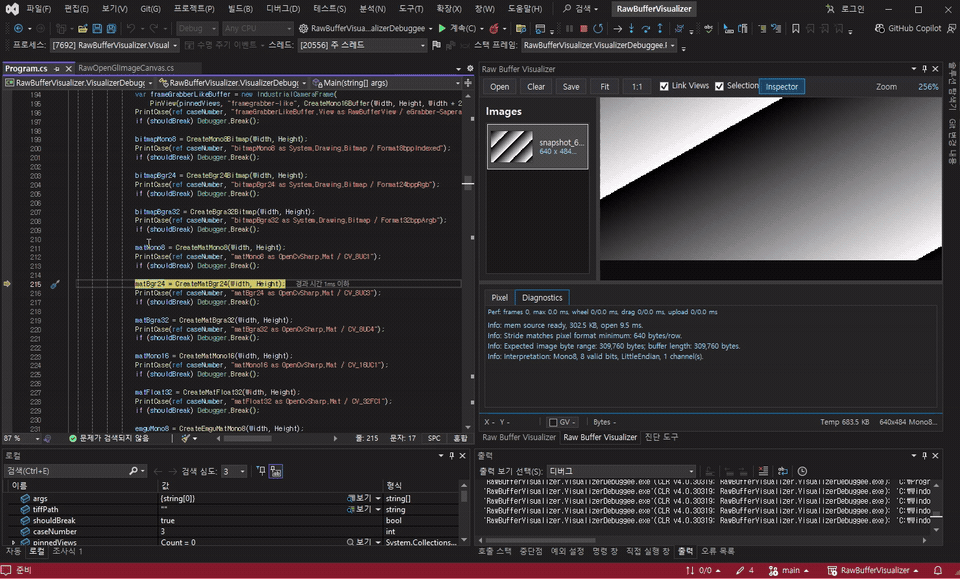

# Raw Buffer Visualizer

### Image Watch for C# and OpenCvSharp machine-vision debugging

[](https://marketplace.visualstudio.com/items?itemName=openvisionlab.RawBufferVisualizer)
[](https://marketplace.visualstudio.com/items?itemName=openvisionlab.RawBufferVisualizer)
[](https://github.com/Noah8218/RawBufferVisualizer/actions/workflows/ci.yml)

**Stop saving temporary images or writing debug-only conversion code. Inspect C# image variables directly while stopped at a breakpoint.**

Inspect `System.Drawing.Bitmap`, OpenCvSharp `Mat`, Emgu CV `Mat`, `IntPtr`-backed images, raw buffers, and supported image collections in one docked Visual Studio window. It combines a C# image debugger, OpenCvSharp and Emgu CV visualizer, IntPtr image viewer, and raw image buffer inspector for machine-vision work.



[Install from Visual Studio Marketplace](https://marketplace.visualstudio.com/items?itemName=openvisionlab.RawBufferVisualizer)

## One-Minute Quick Start

1. Install the extension from [Visual Studio Marketplace](https://marketplace.visualstudio.com/items?itemName=openvisionlab.RawBufferVisualizer) and restart Visual Studio.
2. Start debugging and stop where an image variable is alive.
3. Open DataTip, Watch, Locals, or Autos and click the visualizer icon.
4. Select the new thumbnail in the docked `Raw Buffer Visualizer` window.
5. Use the mouse wheel and drag to zoom and pan, then inspect X/Y, GV or RGB values, raw bytes, stride, and pixel format.

The same workflow works for a single image, a typed `List<TImage>` or `Dictionary<TKey, TImage>`, a mixed object collection, or a supported image array.

## Why Raw Buffer Visualizer?

| Capability | Typical basic Mat viewer | Raw Buffer Visualizer |
| --- | --- | --- |
| OpenCvSharp `Mat` | Common | Supported |
| Emgu CV `Mat` and `System.Drawing.Bitmap` | Varies | Supported |
| `IntPtr` and raw image buffers | Limited | Supported through pointer shapes and `RawBufferView` |
| Stride, byte order, valid bits, and raw-byte diagnostics | Limited | Supported |
| `Mono10PackedLsb` and `Mono12PackedLsb` | Uncommon | Supported |
| Multiple inspected images in one docked list | Varies | Supported |
| Split, absolute diff, blink, and linked pan/zoom | Varies | Supported |
| File-backed tiled display for very large payloads | Uncommon | Supported |

Other debugger visualizers have different feature sets. This comparison describes the difference between a basic Mat-only workflow and the capabilities implemented in this project.

## Key Features

- Single docked Visual Studio window where inspected images accumulate in an `Images` list.
- Open a typed or mixed image list, dictionary, or array once to append its image entries to that same list.
- Image rows include variable/title, thumbnail, width x height, pixel format, stride, and source type.
- Failed opens stay visible as error rows with the reason, instead of disappearing silently.
- Pixel status strip with X/Y, GV or RGB channel values, color swatches, and source bytes.
- High-zoom pixel grid overlay for reading values directly on the image.
- Save the current visible view as PNG, or save a raw `.rbuf.json` snapshot from the image list context menu.
- Hover 5x5 values/statistics, selectable pixel marker overlay, pinned marker, line profile, histogram, and diagnostics.
- Try interpretation controls for changing pixel format, stride, valid bits, and byte order while debugging.
- A/B comparison MVP: set A/B, link pan/zoom, split view, diff view, and blink compare.
- File-backed tiled display for very large raw payloads.


## Install

### Visual Studio extension

Install the Marketplace extension from Visual Studio:

1. Open `Extensions > Manage Extensions`.
2. Search for `Raw Buffer Visualizer`.
3. Install the extension.
4. Close all Visual Studio windows when prompted.
5. Reopen Visual Studio before debugging.

The Marketplace package is one VSIX that contains both parts required for normal use:

- debugger visualizers for supported image variables
- the docked Visual Studio image inspector

Version `1.0.40.0` stabilizes the initial Fit view in resized docked windows and makes Pin freeze the pixel value, 5x5 neighborhood, statistics, marker, and status readouts until Clear is selected. Bitmap, OpenCvSharp `Mat`, Emgu CV `Mat`, raw buffers, pointer-backed images, and typed or mixed image collections continue to route into one docked viewer.

For local development builds, close every Visual Studio window and run this from the repository root:

```powershell
powershell -ExecutionPolicy Bypass -File .\scripts\Install-VisualStudioExtension.ps1 -Configuration Release -Framework net472 -ViewerFramework net472 -Reinstall
```

The script builds and reinstalls the single VSIX, registers the docked ToolWindow, and removes obsolete Raw Buffer Visualizer Classic DLLs from `Documents\Visual Studio 2022\Visualizers`. Restart Visual Studio after it finishes.

### Update

Use `Extensions > Manage Extensions > Updates` in Visual Studio. After the update, close all Visual Studio windows and reopen Visual Studio.

If a lower `Raw Buffer Visualizer` tab from version `1.0.34.0` or earlier is still present in a saved Visual Studio layout, close that tab once. Current Marketplace packages publish the debugger providers and automatically close their temporary handoff host, so new invocations remain in the main docked viewer.

If Visual Studio shows `RawBufferVisualizerPackage did not load correctly` after an update, close all Visual Studio windows and repair the docked tool-window registration:

```powershell
powershell -ExecutionPolicy Bypass -File .\scripts\Repair-VisualStudioExtensionRegistration.ps1
```

This can happen when Visual Studio keeps a stale package path from an older VSIX folder. The repair script points the docked tool window back to the currently installed Marketplace extension folder and removes old startup auto-load registrations.

If the popup appears only when inspecting an image, check:

```text
%TEMP%\RawBufferVisualizer\VisualStudio\package.log
%APPDATA%\Microsoft\VisualStudio\17.0_...\ActivityLog.xml
```

Older `1.0.24.0` builds could require `Microsoft.VisualStudio.Threading 17.14.0.0` and fail on PCs that had not updated Visual Studio to 17.14. Version `1.0.25.0` and later target Visual Studio 2022 17.9-compatible references.

### Uninstall

To uninstall, use `Extensions > Manage Extensions > Installed` in Visual Studio, or uninstall the VSIX by extension id:

```powershell
VSIXInstaller.exe /quiet /uninstall:RawBufferVisualizer.34f8ad30-2f11-4c37-a9d4-00f3a8c1d29f
```

### Standalone viewer

The standalone viewer is optional. It opens saved `.rbuf.json` snapshots and is useful for saved samples, large-image validation, and screenshots.

```powershell
dotnet build .\RawBufferVisualizer.sln -c Release
dotnet run --project .\src\RawBufferVisualizer.Wpf\RawBufferVisualizer.Wpf.csproj -f net8.0-windows -- .\artifacts\samples\mono8-gradient.rbuf.json
```

## Visual Studio Usage

1. Install `Raw Buffer Visualizer` from Visual Studio Marketplace.
2. Start debugging a C# project in Visual Studio.
3. Stop at a breakpoint where a supported image variable is alive.
4. In DataTip, Watch, Locals, or Autos, click the visualizer icon.
5. The image is appended to the docked `Raw Buffer Visualizer` window.
6. Use the `Images` list to switch between captured variables.
7. Use mouse wheel for zoom and mouse drag for pan.
8. Use the status strip and Inspector for pixel values, raw bytes, hover 5x5 statistics, marker values, diagnostics, interpretation, and comparison.
9. Use `Save` to export the current visible view as PNG. Right-click an image row to save the raw snapshot.

To inspect several images at once, click the visualizer on the collection variable itself:

```csharp
var stages = new List<OpenCvSharp.Mat> { inputMat, thresholdMat, resultMat };
var named = new Dictionary<string, OpenCvSharp.Mat>
{
    ["input"] = inputMat,
    ["result"] = resultMat
};
var mixed = new object[] { inputBitmap, resultMat };
```

Collection entries appear as `[0]`, `[1]`, or `[key]` in the existing docked `Images` list. Valid entries remain normal image rows. Null, unsupported, and failed entries remain visible as red error rows with the reason. One invocation processes at most 256 entries; a collection above that limit adds an error row explaining that only the first 256 entries were shown. Lazy or arbitrary `IEnumerable` sequences are intentionally not enumerated while the debugger is paused.

Visual Studio requires generic debugger visualizers to register the open generic `List<>` and `Dictionary<,>` types. Raw Buffer Visualizer therefore appears for typed and mixed lists or dictionaries. It transfers supported image entries only; null, unsupported, and failed entries remain visible as error rows. Visual Studio's built-in `IEnumerable Visualizer` can remain in the visualizer menu, so select `Raw Buffer Visualizer` when more than one visualizer is offered.

The toolbar intentionally stays small: `Open`, `Clear`, `Save`, `Fit`, `1:1`, `Inspector`, and `Link Views` when there is room. Detailed debugging controls stay in the Inspector or compact docked inspector so the Visual Studio workflow remains focused.

The docked layout adapts to the available width:

- Narrow: image list, viewer, Save, status strip, and an `Inspector` toggle.
- Medium: image list, viewer, and bottom tab Inspector.
- Wide: image list, viewer, Descriptor, and full right-side Inspector.


## Supported Inputs

| Input | Status | Notes |
| --- | --- | --- |
| `RawBufferSnapshot` | Supported | SDK snapshot from `byte[]`, `ushort[]`, `float[]`, or `IntPtr`. |
| `RawBufferView` | Supported | Pointer-backed wrapper for common camera/frame-grabber image shapes. |
| `ImagePtr`-style objects | Supported | Reflection-based pointer shape with `Ptr`, `Length`, `Width`, `Height`, `Step`, and `Bpp`. |
| `System.Drawing.Bitmap` | Supported | 8bpp indexed, 24bpp RGB, and 32bpp RGB/ARGB/PARGB mappings. |
| OpenCvSharp `Mat` | Supported | Common 8-bit, 16-bit, and 32-bit float Mat formats. Uses reflection over both legacy and current `Mat` APIs instead of requiring the debuggee's OpenCvSharp package version. |
| Emgu CV `Mat` | Supported | Extracted by reflection, so the extension does not require a direct Emgu dependency. |
| Image collections | Supported | Typed or mixed `List<T>`, `Dictionary<TKey, TValue>`, `ArrayList`, `Hashtable`, `object[]`, and supported image arrays. Up to 256 entries are processed per invocation. |
| `.rbuf.json` + `.raw` | Supported | Snapshot metadata plus raw payload. |
| `.raw` / `.bin` only | Limited | Create a matching `.rbuf.json` descriptor first. |

OpenCvSharp compatibility was exercised with real `Mat` instances from `OpenCvSharp4` packages `4.0.0.20181225`, `4.2.0.20200208`, `4.5.5.20211231`, `4.8.0.20230708`, and `4.13.0.20260627`. Emgu CV compatibility was exercised with real `Mat` instances from packages `3.4.3.3016`, `4.2.0.3662`, `4.5.5.4823`, `4.8.1.5350`, and `4.13.0.5924`. These are tested compatibility points, not a guarantee for every package version between them. `System.Drawing.Bitmap` is handled through the stable .NET Framework drawing API and is tested in the `net472` debugger sample.

Industrial camera and frame-grabber SDK objects are best supported through a common shape adapter first. If your object exposes buffer pointer, width, height, stride, channels, bit depth, and pixel format, inspect it through `RawBufferView` or an `ImagePtr`-style object.

```csharp
var view = new RawBufferView
{
    Buffer = imagePointer,
    BufferLength = stride * height,
    Width = width,
    Height = height,
    Stride = stride,
    PixelFormat = RawPixelFormat.BGR24,
    Channels = 3,
    BitDepth = 8,
    ByteOrder = RawByteOrder.LittleEndian,
    Name = "camera0"
};
```

Inspect `view` directly from Visual Studio after the VSIX is installed. For existing pointer classes, the visualizer can also read this minimal shape:

```csharp
public sealed class ImagePtr
{
    public IntPtr Ptr { get; set; }
    public long Length { get; set; }
    public int Width { get; set; }
    public int Height { get; set; }
    public int Step { get; set; }
    public int Bpp { get; set; } // 1=Mono8, 3=BGR24, 4=BGRA32
}
```

## Supported Pixel Formats

| Format | Storage | Valid Bits | Display |
| --- | ---: | ---: | --- |
| `Mono8` | 1 byte / pixel | 8 | Grayscale |
| `Mono16` | 2 bytes / pixel | 1-16 | Grayscale |
| `Mono10PackedLsb` | 10-bit packed | 10 | Grayscale |
| `Mono12PackedLsb` | 12-bit packed | 12 | Grayscale |
| `Binary` | 1 byte / pixel | 1 | 0 black, non-zero white |
| `RGB24` | 3 bytes / pixel | 8 | Color, RGB byte order |
| `BGR24` | 3 bytes / pixel | 8 | Color, BGR byte order |
| `BGRA32` | 4 bytes / pixel | 8 | Color with alpha |
| `Float32` | 4 bytes / pixel | 32 | Grayscale |
| `BayerRGGB8` | 1 byte / pixel | 8 | Simple Bayer preview |
| `BayerGRBG8` | 1 byte / pixel | 8 | Simple Bayer preview |
| `BayerGBRG8` | 1 byte / pixel | 8 | Simple Bayer preview |
| `BayerBGGR8` | 1 byte / pixel | 8 | Simple Bayer preview |

Unsupported or malformed formats should fail with a visible error row and diagnostics.

## Bitmap And Mat Mappings

| Source format | Visualizer format |
| --- | --- |
| `System.Drawing.Imaging.PixelFormat.Format8bppIndexed` | `Mono8` |
| `System.Drawing.Imaging.PixelFormat.Format24bppRgb` | `BGR24` |
| `System.Drawing.Imaging.PixelFormat.Format32bppArgb` | `BGRA32` |
| `System.Drawing.Imaging.PixelFormat.Format32bppPArgb` | `BGRA32` |
| `System.Drawing.Imaging.PixelFormat.Format32bppRgb` | `BGRA32` |
| OpenCvSharp `CV_8UC1` | `Mono8` |
| OpenCvSharp `CV_8UC3` | `BGR24` |
| OpenCvSharp `CV_8UC4` | `BGRA32` |
| OpenCvSharp `CV_16UC1` | `Mono16` |
| OpenCvSharp `CV_32FC1` | `Float32` |
| Emgu CV `Cv8U`, 1 channel | `Mono8` |
| Emgu CV `Cv8U`, 3 channels | `BGR24` |
| Emgu CV `Cv8U`, 4 channels | `BGRA32` |
| Emgu CV `Cv16U`, 1 channel | `Mono16` |
| Emgu CV `Cv32F`, 1 channel | `Float32` |

## Snapshot Files

A saved snapshot uses two files:

```text
image.raw
image.rbuf.json
```

Example metadata:

```json
{
  "rawFile": "image.raw",
  "width": 2448,
  "height": 2048,
  "stride": 2448,
  "pixelFormat": "Mono8",
  "validBits": 8,
  "byteOrder": "LittleEndian"
}
```

Create a snapshot from code:

```csharp
var descriptor = new RawImageDescriptor
{
    Width = 2448,
    Height = 2048,
    Stride = 2448,
    PixelFormat = RawPixelFormat.Mono8,
    ValidBits = 8,
    ByteOrder = RawByteOrder.LittleEndian
};

RawBufferSnapshot.Save("cam1.rbuf.json", buffer, descriptor);
```

## Large Image Validation

The viewer avoids allocating one full-frame bitmap for large raw payloads. It uses file-backed tiled display and skips CPU-heavy full-frame preview work when needed.

| Case | Current result |
| --- | --- |
| `100000 x 100000` `Mono8` file-backed smoke | Passed with dense 10 GB payload and non-sparse file check. |
| `200000 x 200000` `Mono8` file-backed smoke | Passed with dense 40 GB payload and non-sparse file check. |
| 100k packed `Mono10PackedLsb` and `Mono12PackedLsb` | Passed as file-backed smoke captures. |
| Core tests | Cover descriptor planning, file-backed tile reads, diff rendering, diagnostics, and raw-byte pixel inspection. |

To generate portable `100000 x 100000` and `200000 x 200000` sample files on another PC, see [large image samples](docs/large-image-samples.md).

For OpenCV/Emgu smoke tests with images above OpenCV's default pixel safety limit, set `OPENCV_IO_MAX_IMAGE_PIXELS` before loading the file:

```powershell
$env:OPENCV_IO_MAX_IMAGE_PIXELS = "4000000000"
dotnet run --project .\samples\RawBufferVisualizer.VisualizerDebuggee\RawBufferVisualizer.VisualizerDebuggee.csproj --configuration Release -- --emgu-tiff-smoke "C:\path\large.tif"
```

The large-image dimensions above are validation evidence, not sample payloads committed to Git. Generate the dense files locally with [large image samples](docs/large-image-samples.md).

## Runtime Stability

Raw Buffer Visualizer writes temporary snapshot files while Visual Studio transfers debugger data into the docked viewer. The extension keeps these files under:

```text
%TEMP%\RawBufferVisualizer\VisualStudio
```

Version `1.0.27.0` and later include the following runtime safeguards:

- The docked window status bar shows current temp usage as `Temp ...` so long debug sessions can be monitored.
- The active image status shows whether the payload is memory-backed or file-backed.
- `Clear` and image-row `Delete` dispose loaded sources and remove owned temporary snapshot folders.
- Startup inbox polling now uses file-system events plus backoff polling instead of a fixed 500 ms background loop.
- Payloads above 512 MB are opened as file-backed tiled sources instead of one large `byte[]`.
- Stale owned snapshot folders are cleaned on later visualizer runs when they are older than 24 hours.
- The package log is capped so repeated package-load diagnostics do not grow without bound.

If disk usage looks high after a crashed debug session, close Visual Studio and delete:

```text
%TEMP%\RawBufferVisualizer\VisualStudio
```

Latest recorded stabilization smoke for the current runtime line:

| Check | Result |
| --- | --- |
| VS docked `640 x 484 Mono8` open | Passed, `45.27 ms` open path, `4.117 ms` max frame in local smoke. |
| VS docked temp/session telemetry | Passed, session JSON includes `tempBytes` and per-document `sourceMode`. |
| VS docked responsive layout | Passed at 540, 900, and 1160 px widths. |
| Dense file-backed `24576 x 24576 Mono8` | Passed, `603,979,776` byte payload, 576 tiles, non-dark capture ratio `0.8945`. |

## Build And Test

Build prerequisites:

- Visual Studio 2022 17.9 or newer with .NET desktop development.
- .NET 8 SDK or newer. The solution does not require the .NET 9 SDK.

From a fresh clone, build the solution once before inspecting the generated VSIX payload:

```powershell
dotnet restore .\RawBufferVisualizer.sln
dotnet build .\RawBufferVisualizer.sln -c Release
```

The Visual Studio extension project packages generated files from `.build\bin` into the VSIX. Those DLL and `.pkgdef` payloads are generated build outputs, not source files, and are intentionally hidden from Solution Explorer.

Build:

```powershell
dotnet build .\RawBufferVisualizer.sln -c Release
```

Run core tests:

```powershell
dotnet run --project .\tests\RawBufferVisualizer.Tests\RawBufferVisualizer.Tests.csproj --configuration Release --framework net8.0-windows
```

Run the .NET Framework Bitmap, OpenCvSharp, and Emgu CV version matrix:

```powershell
powershell -ExecutionPolicy Bypass -File .\scripts\SmokeLegacyImageCompatibility.ps1
```

Run Visual Studio docked smoke checks:

```powershell
powershell -ExecutionPolicy Bypass -File .\scripts\SmokeVisualStudioDockedPerformance.ps1 -Configuration Release -Framework net472 -ViewerFramework net472 -NoBuild
powershell -STA -ExecutionPolicy Bypass -File .\scripts\SmokeDockedLayoutWidths.ps1 -Configuration Release -Framework net472 -NoBuild
```

Create sample snapshots:

```powershell
dotnet run --project .\samples\RawBufferVisualizer.Samples\RawBufferVisualizer.Samples.csproj --framework net8.0
```

Run the debugger visualizer sample:

```powershell
dotnet run --project .\samples\RawBufferVisualizer.VisualizerDebuggee\RawBufferVisualizer.VisualizerDebuggee.csproj -- --no-break
```

For manual Visual Studio validation, set `RawBufferVisualizer.VisualizerDebuggee` as the startup project and run under the debugger without `--no-break`. The sample creates individual image variables, typed OpenCvSharp/Emgu CV/Bitmap lists and dictionaries, and mixed object collections and arrays so each visualizer path can be checked from Watch, Locals, Autos, or DataTip. Pass `--collection-only` to stop only at collection cases.

README and Marketplace screenshots must be reviewed before commit. Do not publish screenshots that include unrelated applications, private desktop content, stale UI, or a feature state that does not match the text.

## Release And Marketplace

The Marketplace extension is currently distributed as a preview. Before publishing an update, validate:

- Clean install, update, uninstall, and reinstall of the VSIX.
- Multi-instance isolation: with two separate `devenv.exe` processes running, each debugger visualizer invocation must reach only that Visual Studio instance's docked viewer.
- Docked Visual Studio workflow with narrow and wide tool-window layouts.
- Save PNG, raw snapshot export, pixel status, hover 5x5 statistics, marker values, pan, zoom, high-zoom overlay, and error rows.
- `RawBufferSnapshot`, `RawBufferView`, `ImagePtr`, `Bitmap`, OpenCvSharp `Mat`, Emgu CV `Mat`, and supported collections.
- Large file-backed snapshots and the standalone viewer.
- Package-load smoke after update: Visual Studio must not show `RawBufferVisualizerPackage did not load correctly` on startup.
- VSSDK package compatibility: `RawBufferVisualizer.VisualStudio.Vssdk.dll` must not reference `Microsoft.VisualStudio.Threading` newer than `17.9.0.0`.

See [docs/marketplace-checklist.md](docs/marketplace-checklist.md) for the release checklist.
For repeatable Marketplace updates, use [docs/release-runbook.md](docs/release-runbook.md). The `Marketplace CD` GitHub Actions workflow builds and validates by default, and publishes only when `publish=true` is selected with the Marketplace environment approval.
Marketplace release text for this version: [1.0.40 release notes](docs/marketplace-release-notes-1.0.40.md).
GitHub Release body for this version: [1.0.40 GitHub Release draft](docs/github-release-1.0.40.md).
For the short product video, follow the [20-second demo recording guide](docs/demo-recording-guide.md).

## License

Copyright (c) 2026 Noah Choi.

This project is licensed under the MIT License. You may use, modify, and redistribute the source code, but the copyright and license notice must remain included. See [LICENSE](LICENSE).

External libraries keep their own licenses. Review [THIRD-PARTY-NOTICES.md](THIRD-PARTY-NOTICES.md) before publishing a VSIX, release package, or redistributed binary.
