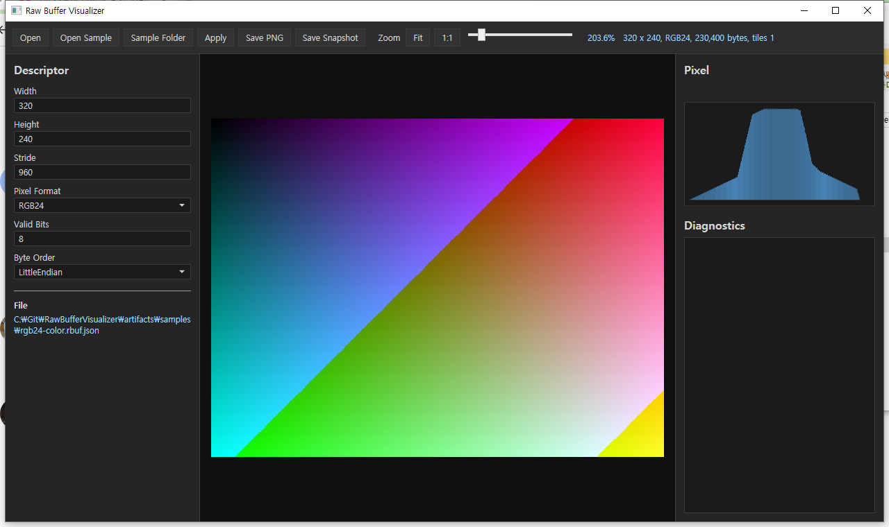
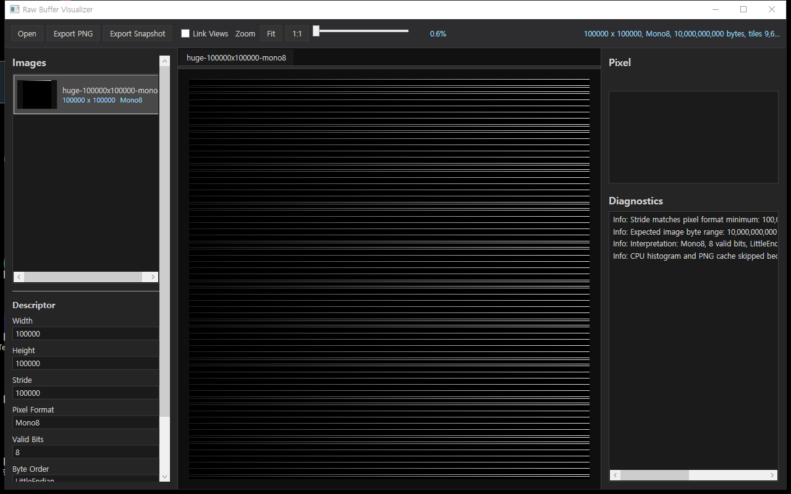
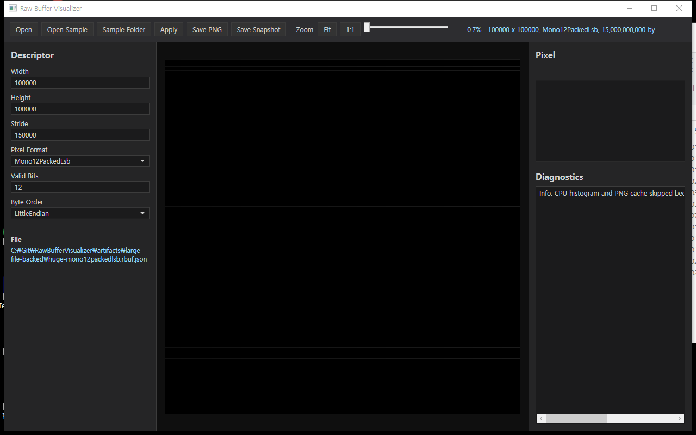

# Raw Buffer Visualizer

[](https://github.com/Noah8218/RawBufferVisualizer/actions/workflows/ci.yml)

Raw Buffer Visualizer is a Windows desktop Image Watch utility for C# machine-vision developers who need to inspect image buffers before they become `Mat`, `Bitmap`, or another high-level image type.

The current priority is Image Watch / Raw Buffer Inspector work: raw buffers, `Mat`, `Bitmap`, `IntPtr`, pixel formats, large-image display, and inspection ergonomics. The final product goal is Visual Studio debugger integration similar to Image Watch.



- Product concept: [PRODUCT_CONCEPT.md](PRODUCT_CONCEPT.md)
- Visual Studio integration plan: [docs/visual-studio-integration.md](docs/visual-studio-integration.md)
- Visual Studio debug test scenarios: [docs/visual-studio-debug-test-scenarios.md](docs/visual-studio-debug-test-scenarios.md)
- Image Watch UX analysis: [docs/image-watch-ux-analysis.md](docs/image-watch-ux-analysis.md)
- SDK adapter roadmap: [docs/sdk-adapter-roadmap.md](docs/sdk-adapter-roadmap.md)

## Current roadmap

1. Finish the standalone Windows Image Watch program.
2. Keep GitHub updated and produce release-ready Windows packages.
3. Add Visual Studio integration so supported image variables can be inspected while debugging.

## Current MVP

- `net472` and modern .NET compatible core library.
- Raw descriptor validation for width, height, stride, pixel format, valid bits, and byte order.
- Snapshot SDK for `byte[]`, `ushort[]`, `float[]`, and `IntPtr`.
- Bitmap adapter for `System.Drawing.Bitmap` snapshots.
- OpenCvSharp adapter for `Mat` snapshots.
- Visual Studio debugger visualizer prototype for chunked `RawBufferSnapshot`, `RawBufferView`, `System.Drawing.Bitmap`, OpenCvSharp `Mat`, and Emgu CV `Mat` transfer.
- WPF viewer for `.rbuf.json` metadata plus `.raw` payload files.
- Drag/drop open, PNG export, snapshot export, pixel inspector, histogram, zoom, and diagnostics panel.
- WPF tiled canvas for large-image display.
- File-backed tiled display for large `.rbuf.json` payloads that should not be loaded into a single managed byte array.
- Large-image guard: CPU histogram/PNG cache is skipped above 512 MB or for file-backed sources; tiled display remains available.
- Windows publish script for release-ready viewer zip packages.

## Supported Inputs And Formats

Standalone viewer input:

| Input | Status | Notes |
| --- | --- | --- |
| `.rbuf.json` + `.raw` | Supported | Metadata points to the raw payload file beside it. |
| `.raw` / `.bin` only | Limited | Wrap it in `.rbuf.json` metadata first. Direct descriptor editing is intentionally not part of the VS-first viewer flow. |
| `RawBufferSnapshot` | Supported | SDK snapshot from `byte[]`, `ushort[]`, `float[]`, or `IntPtr`. |
| `RawBufferView` | Supported | SDK wrapper for `IntPtr Buffer`, width, height, stride, pixel format, channels, bit depth, and byte order. |
| `System.Drawing.Bitmap` | Supported through adapter and Visual Studio prototype | See Bitmap table below. |
| OpenCvSharp `Mat` | Supported through adapter and Visual Studio prototype | See Mat table below. |
| Emgu CV `Mat` | Supported through Visual Studio prototype | Extracted by reflection; no direct Emgu dependency is required by the extension. |

Raw pixel formats:

| Format | Bytes / Packing | Valid Bits | Display |
| --- | ---: | ---: | --- |
| `Mono8` | 1 byte / pixel | 8 | Grayscale |
| `Mono16` | 2 bytes / pixel | 1-16 | Grayscale autoscale, little/big endian |
| `Mono10PackedLsb` | 10-bit LSB packed | 10 | Grayscale autoscale |
| `Mono12PackedLsb` | 12-bit LSB packed | 12 | Grayscale autoscale |
| `Binary` | 1 byte / pixel | 1 | 0 = black, non-zero = white |
| `RGB24` | 3 bytes / pixel | 8 | Color, RGB byte order |
| `BGR24` | 3 bytes / pixel | 8 | Color, BGR byte order |
| `BGRA32` | 4 bytes / pixel | 8 | Color with alpha |
| `Float32` | 4 bytes / pixel | 32 | Grayscale autoscale, little/big endian |
| `BayerRGGB8` | 1 byte / pixel | 8 | Simple 8-bit Bayer preview |
| `BayerGRBG8` | 1 byte / pixel | 8 | Simple 8-bit Bayer preview |
| `BayerGBRG8` | 1 byte / pixel | 8 | Simple 8-bit Bayer preview |
| `BayerBGGR8` | 1 byte / pixel | 8 | Simple 8-bit Bayer preview |

Bitmap formats:

| `System.Drawing.Imaging.PixelFormat` | Mapped Format |
| --- | --- |
| `Format8bppIndexed` | `Mono8` |
| `Format24bppRgb` | `BGR24` |
| `Format32bppArgb` | `BGRA32` |
| `Format32bppPArgb` | `BGRA32` |
| `Format32bppRgb` | `BGRA32` |

OpenCvSharp Mat formats:

| `MatType` | Mapped Format |
| --- | --- |
| `CV_8UC1` | `Mono8` |
| `CV_8UC3` | `BGR24` |
| `CV_8UC4` | `BGRA32` |
| `CV_16UC1` | `Mono16` |
| `CV_32FC1` | `Float32` |

Emgu CV Mat formats:

| `DepthType` / Channels | Mapped Format |
| --- | --- |
| `Cv8U` / 1 | `Mono8` |
| `Cv8U` / 3 | `BGR24` |
| `Cv8U` / 4 | `BGRA32` |
| `Cv16U` / 1 | `Mono16` |
| `Cv32F` / 1 | `Float32` |

Unsupported formats should fail with a clear diagnostics message instead of silently rendering the wrong image.

File-backed large-image display is currently supported for all raw formats listed above. For very large packed `Mono10PackedLsb` and `Mono12PackedLsb` payloads, display uses the native 10-bit or 12-bit range instead of scanning the full file for autoscale levels.

## Download and run

No GitHub Release has been published yet. Until the first version tag is created, use the latest successful CI artifact:

1. Open the latest successful [CI run](https://github.com/Noah8218/RawBufferVisualizer/actions/workflows/ci.yml).
2. Download `RawBufferVisualizer-net9.0-windows-win-x64-sc.zip` from `Artifacts`.
3. Extract the zip to a writable folder such as `C:\Tools\RawBufferVisualizer`.
4. Run `RawBufferVisualizer.Wpf.exe`.
5. Open a `.rbuf.json` snapshot, or pass one or more `.rbuf.json` files as command-line arguments.

The CI run also publishes `RawBufferVisualizer-VisualStudioExtensibility-net8.0-windows.zip` for manual Visual Studio extension validation against `RawBufferSnapshot`, `RawBufferView`, `Bitmap`, OpenCvSharp `Mat`, and Emgu CV `Mat` variables. Extract it and install `RawBufferVisualizer.VisualStudio.Extensibility.vsix` before testing in Visual Studio.

After the first tagged release is created, download the same zip from the [Releases page](https://github.com/Noah8218/RawBufferVisualizer/releases).

The default package is self-contained for Windows x64, so it does not require installing a .NET runtime. If Windows SmartScreen appears because the executable is unsigned, choose `More info` and `Run anyway`, or unblock the zip before extracting it.

To inspect your own data:

- Drag and drop one or more `.rbuf.json` files into the window.
- Use `Open` for a `.rbuf.json` snapshot.
- For raw `.raw` or `.bin` payloads, create a matching `.rbuf.json` through the SDK or `Export Snapshot`.
- Keep `.raw` payload files beside their `.rbuf.json` metadata files.

## Viewer Usage

1. Run `RawBufferVisualizer.Wpf.exe`.
2. Use `Open`, drag/drop, or command-line arguments to load `.rbuf.json` snapshots.
3. Select images from the left `Images` list or top tabs.
4. Use mouse wheel, `Fit`, `1:1`, and the zoom slider to inspect the image.
5. Move the mouse over the image to inspect pixel values.
6. Use `Link Views` when comparing same-size images across tabs.
7. Use `Export PNG` for visible-preview export when CPU preview cache is enabled.
8. Use `Export Snapshot` to write `.rbuf.json` + `.raw`.

## WPF Large Image Canvas

The viewer uses tiled display instead of one full-frame WPF bitmap. The current shared rule is:

- default tile size: `5000 x 5000`
- tile planner: `RawImageTilePlanner.CreateTiles(width, height)`
- memory estimate: `RawImageTilePlanner.EstimateBgraByteCount(descriptor)`

Current large-image validation:

| Case | Result |
| --- | --- |
| `100000 x 100000` `Mono8` descriptor | Verified by automated tile-planner test |
| `100000 x 100000` `Mono8` file-backed viewer smoke | Verified with sparse 10 GB `.raw` payload |
| `100000 x 100000` `Mono10PackedLsb` file-backed viewer smoke | Verified with sparse 12.5 GB `.raw` payload |
| `100000 x 100000` `Mono12PackedLsb` file-backed viewer smoke | Verified with sparse 15 GB `.raw` payload |
| Source payload estimate | `10,000,000,000` bytes |
| BGRA preview estimate | `40,000,000,000` bytes |
| Tile size | `5000 x 5000` |
| Tile count | `400` |
| Viewer status | `100000 x 100000, Mono8, 10,000,000,000 bytes, tiles 400` |






The large-image smoke test uses a sparse raw file so validation can cover 10 GB metadata, file length, tile count, window launch, and visible rendering without writing 10 GB of physical sample data.

## Snapshot format

The MVP uses two files:

```text
image.raw
image.rbuf.json
```

Example metadata:

```json
{
  "rawFile": "image.raw",
  "width": 2448,
  "height": 2048,
  "stride": 2448,
  "pixelFormat": "Mono8",
  "validBits": 8,
  "byteOrder": "LittleEndian"
}
```

## Quick start

Build everything:

```powershell
dotnet build .\RawBufferVisualizer.sln
```

Run self-tests:

```powershell
dotnet run --project .\tests\RawBufferVisualizer.Tests\RawBufferVisualizer.Tests.csproj
```

Run WPF sample smoke test:

```powershell
powershell -ExecutionPolicy Bypass -File .\scripts\SmokeOpenSamples.ps1
```

Run WPF interaction regression test:

```powershell
powershell -ExecutionPolicy Bypass -File .\scripts\SmokeViewerInteractions.ps1
```

Run 100K file-backed large-image smoke test:

```powershell
powershell -ExecutionPolicy Bypass -File .\scripts\SmokeLargeFileBacked.ps1
powershell -ExecutionPolicy Bypass -File .\scripts\SmokeLargeFileBacked.ps1 -PixelFormat Mono10PackedLsb
```

Create a sample buffer:

```powershell
dotnet run --project .\samples\RawBufferVisualizer.Samples\RawBufferVisualizer.Samples.csproj --framework net9.0
```

Run the debugger visualizer debuggee without breakpoints:

```powershell
dotnet run --project .\samples\RawBufferVisualizer.VisualizerDebuggee\RawBufferVisualizer.VisualizerDebuggee.csproj -- --no-break
```

For manual Visual Studio validation, set `RawBufferVisualizer.VisualizerDebuggee` as the startup project and run it under the debugger without `--no-break`. It creates `RawBufferSnapshot`, `RawBufferView`, `Bitmap`, and OpenCvSharp `Mat` variables and stops at each case so the visualizer can be tested from Watch, Locals, Autos, or DataTip. Follow [docs/visual-studio-debug-test-scenarios.md](docs/visual-studio-debug-test-scenarios.md) for the full checklist.

The sample project creates `.rbuf.json` snapshots for every currently supported pixel format:

- `Mono8`, `Mono16`, `Mono10PackedLsb`, `Mono12PackedLsb`, `Binary`
- `RGB24`, `BGR24`, `BGRA32`
- `Float32`
- `BayerRGGB8`, `BayerGRBG8`, `BayerGBRG8`, `BayerBGGR8`

Open the WPF viewer:

```powershell
dotnet run --project .\src\RawBufferVisualizer.Wpf\RawBufferVisualizer.Wpf.csproj -f net9.0-windows -- .\artifacts\samples\mono8-gradient.rbuf.json
```

For .NET Framework deployments, build the `net472` target:

```powershell
dotnet build .\src\RawBufferVisualizer.Wpf\RawBufferVisualizer.Wpf.csproj -f net472
```

## Publish a Windows package

Create a self-contained Windows x64 package for GitHub Releases:

```powershell
powershell -ExecutionPolicy Bypass -File .\scripts\Publish-Windows.ps1
```

The default output is:

```text
artifacts\publish\RawBufferVisualizer-net9.0-windows-win-x64-sc\
artifacts\publish\RawBufferVisualizer-net9.0-windows-win-x64-sc.zip
```

Create a .NET Framework 4.7.2 package:

```powershell
powershell -ExecutionPolicy Bypass -File .\scripts\Publish-Windows.ps1 -Framework net472
```

Samples are copied into the package by default. Use `-SkipSamples` for a smaller package or `-NoZip` when only the publish folder is needed. The `net472` package requires .NET Framework 4.7.2 or newer on the target PC.

## Create a GitHub Release

GitHub Releases are created automatically from semantic version tags:

```powershell
git tag -a v0.1.0 -m "v0.1.0"
git push origin v0.1.0
```

The `Release` workflow builds, tests, publishes the Windows x64 zip, and attaches it to the GitHub Release.

The release workflow also attaches `RawBufferVisualizer-VisualStudioExtensibility-net8.0-windows.zip`. This is a prototype build output for manual Visual Studio validation, not a Marketplace-ready package.

## SDK example

```csharp
var descriptor = new RawImageDescriptor
{
    Width = 2448,
    Height = 2048,
    Stride = 2448,
    PixelFormat = RawPixelFormat.Mono8,
    ValidBits = 8,
    ByteOrder = RawByteOrder.LittleEndian
};

RawBufferSnapshot.Save("cam1.rbuf.json", buffer, descriptor);
```

Bitmap adapter:

```csharp
using RawBufferVisualizer.BitmapAdapter;

var snapshot = BitmapSnapshot.FromBitmap(bitmap);
snapshot.Save("bitmap.rbuf.json");
```

OpenCvSharp adapter:

```csharp
using RawBufferVisualizer.OpenCvSharpAdapter;

var snapshot = MatSnapshot.FromMat(mat);
snapshot.Save("mat.rbuf.json");
```

`Mat` support stays in a separate project so applications that do not use OpenCvSharp do not inherit that dependency.

Industrial camera or frame-grabber pointer wrapper:

```csharp
var view = new RawBufferView
{
    Buffer = imagePointer,
    BufferLength = stride * height,
    Width = width,
    Height = height,
    Stride = stride,
    PixelFormat = RawPixelFormat.BGR24,
    Channels = 3,
    BitDepth = 8,
    ByteOrder = RawByteOrder.LittleEndian,
    Name = "camera0"
};
```

Inspect `view` directly from Visual Studio after the VSIX is installed. For SDK-specific mappings, see [docs/sdk-adapter-roadmap.md](docs/sdk-adapter-roadmap.md).

## Visual Studio integration target

The standalone viewer is the first surface. The final target is Visual Studio integration for debugger-time image inspection:

- Current prototype targets `RawBufferSnapshot`, `RawBufferView`, `System.Drawing.Bitmap`, OpenCvSharp `Mat`, and Emgu CV `Mat`.
- raw pointer buffers through `RawBufferView` when width, height, stride, pixel format, byte order, and lifetime metadata are available
- same viewer behavior for zoom, pixel inspection, histogram, diagnostics, and export

The first implementation plan is documented in [docs/visual-studio-integration.md](docs/visual-studio-integration.md).

## GitHub setup

This repository currently tracks:

```text
https://github.com/Noah8218/RawBufferVisualizer.git
```

Push local commits with:

```powershell
git push
```
