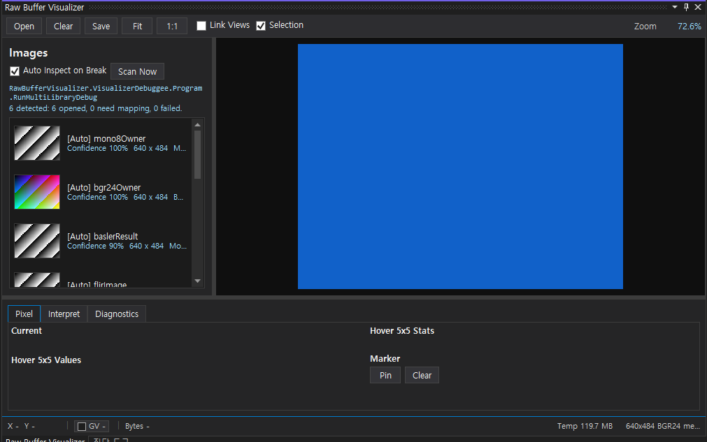
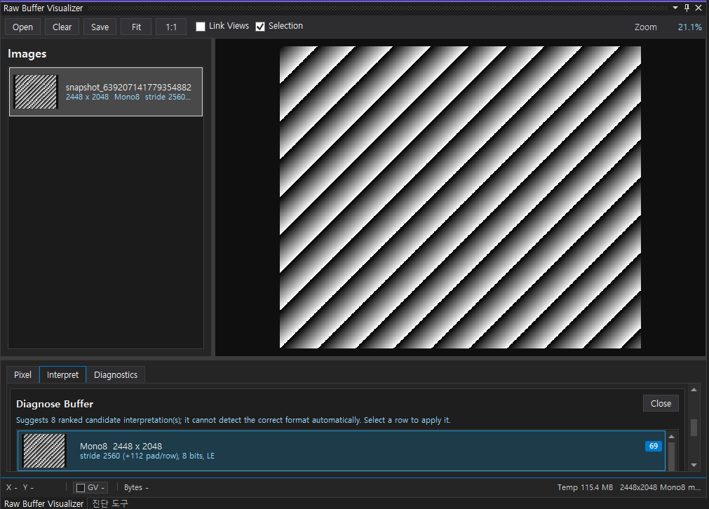
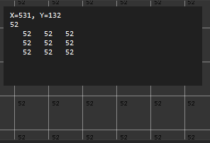
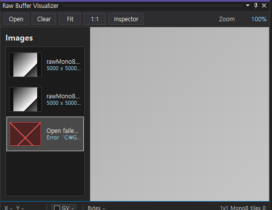

# Raw Buffer Visualizer

### Image Watch for C# and OpenCvSharp machine-vision debugging

[](https://marketplace.visualstudio.com/items?itemName=openvisionlab.RawBufferVisualizer)
[](https://marketplace.visualstudio.com/items?itemName=openvisionlab.RawBufferVisualizer)
[](https://github.com/Noah8218/RawBufferVisualizer/actions/workflows/ci.yml)

**Stop saving temporary images or writing debug-only conversion code. Inspect C# image variables and diagnose raw-buffer mistakes directly at a breakpoint.**

Inspect `System.Drawing.Bitmap`, OpenCvSharp `Mat`, Emgu CV `Mat`, `IntPtr`-backed images, raw buffers, supported image collections, and structurally recognizable camera-frame wrappers in one docked Visual Studio 2022 or Visual Studio 2026 window. It combines registered debugger visualizers with safe current-frame discovery for C# machine-vision work.


[Install from Visual Studio Marketplace](https://marketplace.visualstudio.com/items?itemName=openvisionlab.RawBufferVisualizer)

## 1.0.52 Candidate

The public Marketplace version is `1.0.50.0`, published on 2026-07-29. The exact public package is 2,001,513 bytes with SHA-256 `2014AA8D679AF3D01F0B16CC304E77064ABCF0B0725BDC6BD543B7C08CDA397E`. It contains the direct-Mat, handoff, menu-registration, and Fit/Manual reliability baseline, but predates automatic Mat collection expansion and the in-product release-highlights banner.

The `1.0.52.0` source candidate completes the work built after that public package:

- optional, bounded automatic expansion for exact OpenCvSharp and Emgu CV `Mat` lists and one-dimensional arrays;
- per-element failure isolation so null or disposed Mats do not hide valid images from the same collection;
- a one-time non-modal release summary whose **Dismiss** state survives Visual Studio restarts;
- stable Visual Studio 2026 registered debugger-visualizer activation through the current stable 17.14 Extensibility SDK;
- per-document snapshot leases plus preview/full replacement cleanup;
- refreshed Marketplace and GitHub release communication that matches the actual update.

The original `1.0.51` package remains byte-for-byte preserved as failed VS2026 evidence and will not be published. The package keeps VSPackage GUID `{1977574b-f107-465f-bfd1-5fc022907039}` and the existing Marketplace extension ID, so `1.0.52` remains a normal update from public `1.0.50` on eligible IDEs. Local build/package and VS2022/VS2026 runtime qualification passed. Publication is gated by a separate-PC in-place update from exact public `1.0.50` without repair or `/ResetSkipPkgs`.

When the Raw Buffer Visualizer Tool Window is first opened after installing `1.0.52`, it shows a non-modal summary of the release. **Dismiss** is saved per user across Visual Studio restarts, and **What's New** reopens the current summary without starting a scan or opening an image. See the complete [changelog](CHANGELOG.md).

### Automatic Vision Inspector

Open the docked Tool Window once, leave `Auto Inspect on Break` enabled, and stop at a breakpoint. The inspector scans the selected stack frame's locals and arguments for objects that expose an accessible buffer pointer or managed array together with width, height, stride, and format information.

- `[Auto]` means inference and the current buffer passed validation and the image opened.
- `[Map]` means the object looks image-like but one or more roles are ambiguous. Smart Type Mapper lets you confirm the member or enum mapping once and reuses it later.
- `[Failed]` means the object was recognized but its current pointer, array, or descriptor could not be opened.
- One failed candidate does not prevent the remaining images from opening.
- `Auto Inspect on Break` is a per-user preference that persists across Visual Studio restarts. `Scan Now` still works while automatic scanning is off.

Initialized exact OpenCvSharp `Mat` and Emgu CV `Mat` values can use Automatic Inspector's validated live-memory path and still retain their debugger-visualizer icons. An optional persisted **Mat collections** mode expands exact Mat `List<T>` and one-dimensional arrays with bounded per-element success/failure rows. `System.Drawing.Bitmap`, `RawBufferSnapshot`, `RawBufferView`, and other registered collections remain on their registered visualizer paths. Bitmap automatic extraction would require a `LockBits`/`UnlockBits` lifecycle inside the debuggee, which Automatic Inspector deliberately does not inject or invoke.

Visual Studio stops before executing the highlighted breakpoint statement. If the breakpoint is on `Bitmap bitmap = new Bitmap(...)`, `bitmap` is not initialized yet. Stop on the next executable line, or use **Scan Now** only after the image object exists in the selected stack frame.



### Vision Buffer Doctor

When an image looks sheared, too dark, scrambled, or incorrectly packed, select `Interpret > Diagnose Buffer`. Buffer Doctor ranks plausible width, height, stride, pixel format, valid-bit, and byte-order interpretations from bounded samples. Selecting a candidate applies it immediately without another debugger round trip.

Buffer Doctor is a buffer-layout assistant, not a semantic image detector. RGB/BGR and Bayer phase can remain inherently ambiguous, so the UI keeps tied candidates visible for the developer to confirm.



## One-Minute Quick Start

1. Install the extension from [Visual Studio Marketplace](https://marketplace.visualstudio.com/items?itemName=openvisionlab.RawBufferVisualizer) and restart Visual Studio.
2. Open `View > Other Windows > Raw Buffer Visualizer` once.
3. Start debugging and stop where image variables or camera-frame wrappers are alive.
4. Let `Auto Inspect on Break` open initialized OpenCvSharp/Emgu Mats and safe unregistered wrappers. Enable **Mat collections** when exact Mat lists/arrays should also expand automatically. For Bitmap and other registered collections, click the `Raw Buffer Visualizer` icon in DataTip, Watch, Locals, or Autos.
5. Select a thumbnail, zoom or pan, and inspect X/Y, GV or RGB values, raw bytes, stride, and pixel format.
6. If a raw image looks wrong, run `Interpret > Diagnose Buffer` and select the most plausible candidate.

The same workflow works for a single image, a typed `List<TImage>` or `Dictionary<TKey, TImage>`, a mixed object collection, or a supported image array.

## Why Raw Buffer Visualizer?

| Capability | Typical basic Mat viewer | Raw Buffer Visualizer |
| --- | --- | --- |
| OpenCvSharp `Mat` | Common | Supported |
| Emgu CV `Mat` and `System.Drawing.Bitmap` | Varies | Supported |
| `IntPtr` and raw image buffers | Limited | Supported through pointer shapes and `RawBufferView` |
| Current-frame discovery for unregistered camera wrappers | Uncommon | Safe pointer/array-backed shapes in locals and arguments |
| Ranked recovery for wrong stride/format/byte order | Uncommon | Vision Buffer Doctor |
| Stride, byte order, valid bits, and raw-byte diagnostics | Limited | Supported |
| `Mono10PackedLsb` and `Mono12PackedLsb` | Uncommon | Supported |
| Multiple inspected images in one docked list | Varies | Supported |
| Split, absolute diff, blink, and linked pan/zoom | Varies | Supported |
| File-backed tiled display for very large payloads | Uncommon | Supported |

Other debugger visualizers have different feature sets. This comparison describes the difference between a basic Mat-only workflow and the capabilities implemented in this project.

## Key Features

- Automatic Vision Inspector for safe image-like locals and arguments, with isolated `[Auto]`, `[Map]`, and `[Failed]` outcomes.
- Smart Type Mapper as the recovery path for ambiguous company-specific image wrappers.
- Vision Buffer Doctor with ranked, immediately applicable raw-buffer interpretations.
- Single docked Visual Studio window where inspected images accumulate in an `Images` list.
- Open a typed or mixed image list, dictionary, or array once to append its image entries to that same list.
- Image rows include variable/title, thumbnail, width x height, pixel format, stride, and source type.
- Failed opens stay visible as error rows with the reason, instead of disappearing silently.
- Pixel status strip with X/Y, GV or RGB channel values, color swatches, and source bytes.
- High-zoom pixel grid overlay for reading values directly on the image.
- Save the current visible view as PNG, or save a raw `.rbuf.json` snapshot from the image list context menu.
- Hover 5x5 values/statistics, selectable pixel marker overlay, pinned marker, line profile, histogram, and diagnostics.
- Try interpretation controls for changing pixel format, stride, valid bits, and byte order while debugging.
- A/B comparison MVP: set A/B, link pan/zoom, split view, diff view, and blink compare.
- File-backed tiled display for very large raw payloads.



## Install

### Visual Studio compatibility

| Product | Supported versions | Current qualification |
| --- | --- | --- |
| Visual Studio 2022 | `17.14` or newer, x64 | Exact `1.0.52` candidate passed the installed core matrix on Community `17.14.33` (`17.14.37314.3`); separate-PC public-package update remains pending. |
| Visual Studio 2026 | Stable `18.x`, x64 | The same exact `1.0.52` candidate passed the installed core matrix on Community `18.8.2` (`18.8.12023.21`). |

Community, Professional, and Enterprise editions are installation targets. Visual Studio 2019, 32-bit Visual Studio, and Preview/Insiders builds are not supported release targets.

The manifest uses the API range `[17.14,18.0)`. This is compatible with Visual Studio 2026 because VS2026 supports Visual Studio API version 17.x and evaluates the lower bound while ignoring the old product-version upper bound. See [Microsoft's extension compatibility model](https://learn.microsoft.com/en-us/visualstudio/extensibility/migration/extension-compatibility?view=visualstudio).

### Visual Studio extension

Install the Marketplace extension from Visual Studio:

1. Open `Extensions > Manage Extensions`.
2. Search for `Raw Buffer Visualizer`.
3. Install the extension.
4. Close all Visual Studio windows when prompted.
5. Reopen Visual Studio before debugging.

The Marketplace package is one VSIX that contains both parts required for normal use:

- debugger visualizers for supported image variables
- the docked Visual Studio image inspector

The `1.0.47.0` feature line added Automatic Vision Inspector and Vision Buffer Doctor. Public `1.0.50.0` uses the current VSPackage identity and contains the direct-Mat, handoff, menu, and Fit reliability baseline. The source is now `1.0.52.0`, which keeps that identity and adds automatic Mat collection inspection, in-product release highlights, VS2026 activation compatibility, and leased snapshot ownership.

For local development builds, close every Visual Studio window and run this from the repository root:

```powershell
powershell -ExecutionPolicy Bypass -File .\scripts\Install-VisualStudioExtension.ps1 -Configuration Release -Framework net472 -ViewerFramework net472 -Reinstall
```

The script builds and reinstalls the single VSIX and removes obsolete Raw Buffer Visualizer Classic DLLs from the Visual Studio 2022/2026 `Visualizers` folders. It intentionally does not write VSSDK registration values; the installed VSIX must register the docked ToolWindow by itself. Restart Visual Studio after it finishes.

### Update

Use `Extensions > Manage Extensions > Updates` in Visual Studio. After the update, close all Visual Studio windows and reopen Visual Studio.

If a lower `Raw Buffer Visualizer` tab from version `1.0.34.0` or earlier is still present in a saved Visual Studio layout, close that tab once. Current Marketplace packages publish the debugger providers and automatically close their temporary handoff host, so new invocations remain in the main docked viewer.

For `1.0.48` and later, a release must not be qualified by manually writing a package `CodeBase`. Qualification of `1.0.52` requires a real update from the exact public `1.0.50` package without uninstall, repair, or `/ResetSkipPkgs`; a clean install alone is insufficient. If an older developer installation left a stale registration, close all Visual Studio windows and use the repair script only as a local migration/recovery step:

```powershell
powershell -ExecutionPolicy Bypass -File .\scripts\Repair-VisualStudioExtensionRegistration.ps1
```

The repair script points the docked tool window back to the currently installed Marketplace extension folder and removes old startup auto-load registrations. After recovery, reinstall the release VSIX without repair and run the installed-VSIX smoke before treating the package as publishable.

If the popup appears only when inspecting an image, check:

```text
%TEMP%\RawBufferVisualizer\VisualStudio\package.log
%APPDATA%\Microsoft\VisualStudio\17.0_...\ActivityLog.xml
```

Versions `1.0.25` through `1.0.51` retained the Visual Studio 2022 17.9 API floor. Version `1.0.52` intentionally moves the minimum to the serviced Visual Studio 2022 17.14 baseline because the newer Extensibility runtime is required for stable Visual Studio 2026 activation.

### Uninstall

To uninstall, use `Extensions > Manage Extensions > Installed` in Visual Studio, or uninstall the VSIX by extension id:

```powershell
VSIXInstaller.exe /quiet /uninstall:RawBufferVisualizer.34f8ad30-2f11-4c37-a9d4-00f3a8c1d29f
```

### Standalone viewer

The standalone viewer is optional. It opens saved `.rbuf.json` snapshots and is useful for saved samples, large-image validation, and screenshots.

```powershell
dotnet build .\RawBufferVisualizer.sln -c Release
dotnet run --project .\src\RawBufferVisualizer.Wpf\RawBufferVisualizer.Wpf.csproj -f net8.0-windows -- .\artifacts\samples\mono8-gradient.rbuf.json
```

## Visual Studio Usage

For unregistered image wrappers:

1. Open `View > Other Windows > Raw Buffer Visualizer`.
2. Keep `Auto Inspect on Break` enabled, or use `Scan Now` on demand.
3. Stop at a breakpoint. The selected frame's locals and arguments are scanned without forcing the Tool Window to open or steal focus.
4. Review automatic image rows. Use `Map` only for an ambiguous type; the saved mapping is reused on later breaks and Visual Studio sessions.

For registered image types and collections:

1. Install `Raw Buffer Visualizer` from Visual Studio Marketplace.
2. Start debugging a C# project in Visual Studio.
3. Stop at a breakpoint where a supported image variable is alive.
4. In DataTip, Watch, Locals, or Autos, click the visualizer icon.
5. The image is appended to the docked `Raw Buffer Visualizer` window.
6. Use the `Images` list to switch between captured variables.
7. Use mouse wheel for zoom and mouse drag for pan.
8. Use the status strip and Inspector for pixel values, raw bytes, hover 5x5 statistics, marker values, diagnostics, interpretation, and comparison.
9. Use `Save` to export the current visible view as PNG. Right-click an image row to save the raw snapshot.

To inspect several images at once, click the visualizer on the collection variable itself:

```csharp
var stages = new List<OpenCvSharp.Mat> { inputMat, thresholdMat, resultMat };
var named = new Dictionary<string, OpenCvSharp.Mat>
{
    ["input"] = inputMat,
    ["result"] = resultMat
};
var mixed = new object[] { inputBitmap, resultMat };
```

Collection entries appear as `[0]`, `[1]`, or `[key]` in the existing docked `Images` list. Valid entries remain normal image rows. Null, unsupported, and failed entries remain visible as red error rows with the reason. One invocation processes at most 256 entries; a collection above that limit adds an error row explaining that only the first 256 entries were shown. Lazy or arbitrary `IEnumerable` sequences are intentionally not enumerated while the debugger is paused.

When an image cannot be opened, select its red error row. The viewer shows a stable error ID, the failure reason, `Copy Report`, and `Open Logs`. `Copy Report` includes the extension and Visual Studio versions, source type, descriptor/diagnostics, and stack details when available. It does not include the image payload. Review paths and variable names in the report before sharing it in a GitHub issue.

Visual Studio requires generic debugger visualizers to register the open generic `List<>` and `Dictionary<,>` types. Raw Buffer Visualizer therefore appears for typed and mixed lists or dictionaries. It transfers supported image entries only; null, unsupported, and failed entries remain visible as error rows. Visual Studio's built-in `IEnumerable Visualizer` can remain in the visualizer menu, so select `Raw Buffer Visualizer` when more than one visualizer is offered.

The toolbar intentionally stays small: `Open`, `Clear`, `Save`, `Fit`, `1:1`, `Inspector`, and `Link Views` when there is room. Detailed debugging controls stay in the Inspector or compact docked inspector so the Visual Studio workflow remains focused.

The docked layout adapts to the available width:

- Narrow: image list, viewer, Save, status strip, and an `Inspector` toggle.
- Medium: image list, viewer, and bottom tab Inspector.
- Wide: image list, viewer, Descriptor, and full right-side Inspector.



## Supported Inputs

| Input | Status | Notes |
| --- | --- | --- |
| `RawBufferSnapshot` | Supported | SDK snapshot from `byte[]`, `ushort[]`, `float[]`, or `IntPtr`. |
| `RawBufferView` | Supported | Pointer-backed wrapper for common camera/frame-grabber image shapes. |
| Unregistered camera/frame wrappers | Conditional | Automatic Inspector supports debugger-visible pointer/array, width, height, stride, and pixel-format shapes. Ambiguous enum/member roles require one saved mapping. |
| Exact ImagePtr compatibility target | Limited | The debugger icon is registered for the existing `Cressem.ImageModel.ImagePtr` contract. Other types should use `RawBufferView` or Automatic Inspector. |
| `System.Drawing.Bitmap` | Supported | 8bpp indexed, 24bpp RGB, and 32bpp RGB/ARGB/PARGB mappings. |
| OpenCvSharp `Mat` | Supported | Common 8-bit, 16-bit, and 32-bit float Mat formats. Uses reflection over both legacy and current `Mat` APIs instead of requiring the debuggee's OpenCvSharp package version. |
| Emgu CV `Mat` | Supported | Extracted by reflection, so the extension does not require a direct Emgu dependency. |
| Image collections | Supported | Typed or mixed `List<T>`, `Dictionary<TKey, TValue>`, `ArrayList`, `Hashtable`, `object[]`, and supported image arrays. Up to 256 entries are processed per invocation. |
| Automatic Mat collections | `1.0.52` candidate | Optional exact OpenCvSharp/Emgu `Mat` lists and one-dimensional arrays; 8 items per collection, 16 items and 8 roots per scan. Bitmap and broad collections remain glyph-owned. |
| `.rbuf.json` + `.raw` | Supported | Snapshot metadata plus raw payload. |
| `.raw` / `.bin` only | Limited | Create a matching `.rbuf.json` descriptor first. |

OpenCvSharp compatibility was exercised with real `Mat` instances from `OpenCvSharp4` packages `4.0.0.20181225`, `4.2.0.20200208`, `4.5.5.20211231`, `4.8.0.20230708`, and `4.13.0.20260627`. Emgu CV compatibility was exercised with real `Mat` instances from packages `3.4.3.3016`, `4.2.0.3662`, `4.5.5.4823`, `4.8.1.5350`, and `4.13.0.5924`. These are tested compatibility points, not a guarantee for every package version between them. `System.Drawing.Bitmap` is handled through the stable .NET Framework drawing API and is tested in the `net472` debugger sample.

Industrial camera and frame-grabber SDK objects are best supported through a common shape adapter first. If your object exposes buffer pointer, width, height, stride, channels, bit depth, and pixel format, inspect it through `RawBufferView`. Automatic Inspector can also recognize many existing wrappers when those members are debugger-visible.

```csharp
var view = new RawBufferView
{
    Buffer = imagePointer,
    BufferLength = stride * height,
    Width = width,
    Height = height,
    Stride = stride,
    PixelFormat = RawPixelFormat.BGR24,
    Channels = 3,
    BitDepth = 8,
    ByteOrder = RawByteOrder.LittleEndian,
    Name = "camera0"
};
```

Inspect `view` directly from Visual Studio after the VSIX is installed. For existing pointer classes, the visualizer can also read this minimal shape:

```csharp
public sealed class ImagePtr
{
    public IntPtr Ptr { get; set; }
    public long Length { get; set; }
    public int Width { get; set; }
    public int Height { get; set; }
    public int Step { get; set; }
    public int Bpp { get; set; } // 1=Mono8, 3=BGR24, 4=BGRA32
}
```

## Supported Pixel Formats

| Format | Storage | Valid Bits | Display |
| --- | ---: | ---: | --- |
| `Mono8` | 1 byte / pixel | 8 | Grayscale |
| `Mono16` | 2 bytes / pixel | 1-16 | Grayscale |
| `Mono10PackedLsb` | 10-bit packed | 10 | Grayscale |
| `Mono12PackedLsb` | 12-bit packed | 12 | Grayscale |
| `Binary` | 1 byte / pixel | 1 | 0 black, non-zero white |
| `RGB24` | 3 bytes / pixel | 8 | Color, RGB byte order |
| `BGR24` | 3 bytes / pixel | 8 | Color, BGR byte order |
| `BGRA32` | 4 bytes / pixel | 8 | Color with alpha |
| `Float32` | 4 bytes / pixel | 32 | Grayscale |
| `BayerRGGB8` | 1 byte / pixel | 8 | Simple Bayer preview |
| `BayerGRBG8` | 1 byte / pixel | 8 | Simple Bayer preview |
| `BayerGBRG8` | 1 byte / pixel | 8 | Simple Bayer preview |
| `BayerBGGR8` | 1 byte / pixel | 8 | Simple Bayer preview |

Unsupported or malformed formats should fail with a visible error row and diagnostics.

## Bitmap And Mat Mappings

| Source format | Visualizer format |
| --- | --- |
| `System.Drawing.Imaging.PixelFormat.Format8bppIndexed` | `Mono8` |
| `System.Drawing.Imaging.PixelFormat.Format24bppRgb` | `BGR24` |
| `System.Drawing.Imaging.PixelFormat.Format32bppArgb` | `BGRA32` |
| `System.Drawing.Imaging.PixelFormat.Format32bppPArgb` | `BGRA32` |
| `System.Drawing.Imaging.PixelFormat.Format32bppRgb` | `BGRA32` |
| OpenCvSharp `CV_8UC1` | `Mono8` |
| OpenCvSharp `CV_8UC3` | `BGR24` |
| OpenCvSharp `CV_8UC4` | `BGRA32` |
| OpenCvSharp `CV_16UC1` | `Mono16` |
| OpenCvSharp `CV_32FC1` | `Float32` |
| Emgu CV `Cv8U`, 1 channel | `Mono8` |
| Emgu CV `Cv8U`, 3 channels | `BGR24` |
| Emgu CV `Cv8U`, 4 channels | `BGRA32` |
| Emgu CV `Cv16U`, 1 channel | `Mono16` |
| Emgu CV `Cv32F`, 1 channel | `Float32` |

## Snapshot Files

A saved snapshot uses two files:

```text
image.raw
image.rbuf.json
```

Example metadata:

```json
{
  "rawFile": "image.raw",
  "width": 2448,
  "height": 2048,
  "stride": 2448,
  "pixelFormat": "Mono8",
  "validBits": 8,
  "byteOrder": "LittleEndian"
}
```

Create a snapshot from code:

```csharp
var descriptor = new RawImageDescriptor
{
    Width = 2448,
    Height = 2048,
    Stride = 2448,
    PixelFormat = RawPixelFormat.Mono8,
    ValidBits = 8,
    ByteOrder = RawByteOrder.LittleEndian
};

RawBufferSnapshot.Save("cam1.rbuf.json", buffer, descriptor);
```

## Large Image Validation

The viewer avoids allocating one full-frame bitmap for large raw payloads. It uses file-backed tiled display and skips CPU-heavy full-frame preview work when needed.

| Case | Current result |
| --- | --- |
| `100000 x 100000` `Mono8` file-backed smoke | Passed with dense 10 GB payload and non-sparse file check. |
| `200000 x 200000` `Mono8` file-backed smoke | Passed with dense 40 GB payload and non-sparse file check. |
| 100k packed `Mono10PackedLsb` and `Mono12PackedLsb` | Passed as file-backed smoke captures. |
| Core tests | Cover descriptor planning, file-backed tile reads, diff rendering, diagnostics, and raw-byte pixel inspection. |

To generate portable `100000 x 100000` and `200000 x 200000` sample files on another PC, see [large image samples](docs/large-image-samples.md).

For OpenCV/Emgu smoke tests with images above OpenCV's default pixel safety limit, set `OPENCV_IO_MAX_IMAGE_PIXELS` before loading the file:

```powershell
$env:OPENCV_IO_MAX_IMAGE_PIXELS = "4000000000"
dotnet run --project .\samples\RawBufferVisualizer.VisualizerDebuggee\RawBufferVisualizer.VisualizerDebuggee.csproj --configuration Release -- --emgu-tiff-smoke "C:\path\large.tif"
```

The large-image dimensions above are validation evidence, not sample payloads committed to Git. Generate the dense files locally with [large image samples](docs/large-image-samples.md).

## Viewer Performance

The table below compares the viewer before and after the progressive viewport update using the same machine, automated smoke, and dense `5000 x 5000 Mono8` input (`25,000,000` raw bytes). Lower values are better.

| Metric | Before update | Current (`1.0.45`) | Improvement |
| --- | ---: | ---: | ---: |
| Initial open path | `179.818 ms` | `115.369 ms` | `35.8%` lower |
| Zoom average frame | `16.684 ms` | `13.765 ms` | `17.5%` lower |
| Zoom maximum frame | `49.397 ms` | `36.527 ms` | `26.1%` lower |
| Pan maximum frame | `21.951 ms` | `17.056 ms` | `22.3%` lower |
| Pan average tile upload | `20.410 ms` | `15.211 ms` | `25.5%` lower |

An installed-VSIX check in Visual Studio 2022 `17.14` also exercised a dense file-backed `24000 x 24000 Mono8` image with real mouse input. Across `87` wheel and `269` drag events, input handling averaged `0.095 ms` and `0.033 ms`; rendered frames averaged `6.515 ms` with a `13.642 ms` maximum. Pixel status, selection, and pinned-marker state remained active during the run.

These measurements are regression evidence from one test machine, not guaranteed timings for every PC. Image format, storage, GPU driver, debugger state, and docked-window size can change the result.

## Runtime Stability

Raw Buffer Visualizer writes temporary snapshot files while Visual Studio transfers debugger data into the docked viewer. The extension keeps these files under:

```text
%TEMP%\RawBufferVisualizer\VisualStudio
```

Version `1.0.27.0` and later include the following runtime safeguards:

- The docked window status bar shows current temp usage as `Temp ...` so long debug sessions can be monitored.
- The active image status shows whether the payload is memory-backed or file-backed.
- `Clear` and image-row `Delete` dispose loaded sources and remove owned temporary snapshot folders.
- Startup inbox polling now uses file-system events plus backoff polling instead of a fixed 500 ms background loop.
- Payloads above 512 MB are opened as file-backed tiled sources instead of one large `byte[]`.
- Stale owned snapshot folders are cleaned on later visualizer runs when they are older than 24 hours.
- Every open owned snapshot holds a lease, so stale cleanup skips its payload until preview replacement, document removal, Clear, or Tool Window disposal releases it.
- The package log is capped so repeated package-load diagnostics do not grow without bound.

Preview-to-full replacement acquires the new snapshot lease before releasing the previous directory. Closing or removing a document releases and deletes its current owned snapshot; a crashed Visual Studio process leaves an unlocked marker that a later stale sweep can remove.

If disk usage looks high after a crashed debug session, close Visual Studio and delete:

```text
%TEMP%\RawBufferVisualizer\VisualStudio
```

Recorded evidence is split between the public Marketplace baseline, the current `1.0.52` candidate, the preserved failed `1.0.51` candidate, and historical stress/compatibility runs:

| Check | Result |
| --- | --- |
| Current exact `1.0.52` candidate | 1,902,513 bytes; SHA-256 `3DD78167E60BB7DCC4C3AC1EE83622DEBFF75CEFC2D040977F1D854E33EB9E1F`. Release build, package/communication guards, aggregate self-tests, installed registration audit, and Marketplace dry run passed. Workspace lifecycle, snapshot lease/replacement, and handoff ACK/NACK tests are included. |
| Current `1.0.52` installed runtime | The same package passed ReleaseAnnouncement, AutomaticCollections, and MultiLibraryHybrid on VS2022 Community `17.14.33` and VS2026 Community `18.8.2`: 9 hybrid documents, 0 errors, one Open/Scan command each, and 0 protocol errors. Evidence: `D:\OpenVisionLab-TestData\RawBufferVisualizer\release-1.0.52`. |
| Preserved failed `1.0.51` package | 2,011,587 bytes; SHA-256 `7219386F9B8C452EE6AB06AED73B7BB13AC4581547D0B47DC8E731B6797B015F`. VS2022 passed, but stable VS2026 `18.8.2` could not activate the registered provider because the older Extensibility framework requested the unavailable host-contract assembly version `17.0.0.0`. |
| Public Marketplace `1.0.50` baseline | Exact downloaded package: 2,001,513 bytes; SHA-256 `2014AA8D679AF3D01F0B16CC304E77064ABCF0B0725BDC6BD543B7C08CDA397E`. It predates automatic Mat collection expansion and the in-product release-highlights banner. |
| Current-source Fit/Manual matrix | 540/900/1160 px passed with aspect errors 0, Fit margin 1.05, and Manual zoom/center delta 0. This is current-source view evidence, not an installed-VSIX Fit behavioral run. |
| Full solution and unit-style self-tests (historical runtime line) | Passed for the declared `net472`, `netstandard2.0`, and .NET 8 targets. |
| Legacy image libraries | Passed with five OpenCvSharp and five Emgu CV package versions plus .NET Framework Bitmap. |
| Standalone viewer interactions | Passed open, pixel/GV read, Fit, 1:1, slider and wheel zoom, PNG/snapshot export, tabs, and linked views. |
| VS2022 docked `5000 x 5000 Mono8` | Passed with `115.3 ms` open path, `1.24 ms` max wheel command, `0.77 ms` max drag command, and `33.94 ms` max frame. |
| Installed VSIX, real `8192 x 8192` Mats (historical) | Passed in VS2022 17.14 with OpenCvSharp and Emgu CV, correct GV values, at most `1 MiB` per new preview file, and controlled `Unavailable` state after debuggee exit. This is not exact `1.0.51` evidence. |
| Installed VSIX, hybrid current-frame session | Exact `1.0.52` passed in VS2022 17.14 and VS2026 18.8 with OpenCvSharp, Emgu CV, Bitmap, and five pointer-backed camera-shape fixtures; 9 images, 0 errors, 8/8 automatic opens, and no duplicate registered-type rows. |
| Dense file-backed `100000 x 100000 Mono8` | Passed with a non-sparse `10,000,000,000` byte payload, `1.73 s` first visible time, and `88.0 MB` working set. |
| Dense file-backed `200000 x 200000 Mono8` | Passed with a non-sparse `40,000,000,000` byte payload, `1.94 s` first visible time, and `87.5 MB` working set. |
| Docked accumulation and cleanup soak | Passed 240 repeated `2048 x 2048 Mono8` opens using both selected-item Delete and Clear, with no positive managed/private/working-set growth, no GDI/USER growth, and no owned temporary directories left behind. |

## Build And Test

Build prerequisites:

- Visual Studio 2022 17.14 or newer with .NET desktop development.
- .NET 8 SDK or newer. The solution does not require the .NET 9 SDK.

From a fresh clone, build the solution once before inspecting the generated VSIX payload:

```powershell
dotnet restore .\RawBufferVisualizer.sln
dotnet build .\RawBufferVisualizer.sln -c Release
```

The hybrid `RawBufferVisualizer.VisualStudio.Extensibility` project owns debugger providers, the `RawBufferVisualizerPackage` registration shell, command table compilation, and the public VSIX. Its `PkgdefProjectOutputGroup` generates `RawBufferVisualizer.VisualStudio.Extensibility.pkgdef` with a `CodeBase` under `$PackageFolder$`. The `RawBufferVisualizer.VisualStudio.Vssdk` project is a referenced ToolWindow/UI support library and must not produce the Marketplace package registration.

Build:

```powershell
dotnet build .\RawBufferVisualizer.sln -c Release
```

Run core tests:

```powershell
dotnet run --project .\tests\RawBufferVisualizer.Tests\RawBufferVisualizer.Tests.csproj --configuration Release --framework net8.0-windows
```

Run the .NET Framework Bitmap, OpenCvSharp, and Emgu CV version matrix:

```powershell
powershell -ExecutionPolicy Bypass -File .\scripts\SmokeLegacyImageCompatibility.ps1
```

Run Visual Studio docked smoke checks:

```powershell
powershell -ExecutionPolicy Bypass -File .\scripts\SmokeVisualStudioDockedPerformance.ps1 -Configuration Release -Framework net472 -ViewerFramework net472 -NoBuild
powershell -STA -ExecutionPolicy Bypass -File .\scripts\SmokeDockedLayoutWidths.ps1 -Configuration Release -Framework net472 -NoBuild
```

Run the large-image preview and installed-VSIX regression checks:

```powershell
powershell -ExecutionPolicy Bypass -File .\scripts\SmokePreviewFirstHandoff.ps1 -Configuration Release -Framework net472 -NoBuild
powershell -ExecutionPolicy Bypass -File .\scripts\SmokeSampledPreviewPerformance.ps1 -Configuration Release -Framework net472 -NoBuild
powershell -ExecutionPolicy Bypass -File .\scripts\SmokeInstalledVsixLargeMats.ps1 -Configuration Release -VisualStudioInstanceId <VS2022-instance-id> -NoBuild
powershell -STA -ExecutionPolicy Bypass -File .\scripts\SmokeDockedMemorySoak.ps1 -Configuration Release -Framework net472 -NoBuild
powershell -ExecutionPolicy Bypass -File .\scripts\SmokeInstalledVsixNewFeatures.ps1 -Scenario MultiLibraryHybrid -Configuration Release -NoBuild -NoInstall
```

The installed-VSIX smoke opens real OpenCvSharp and Emgu CV `8192 x 8192` Mats in Visual Studio 2022, checks pixel values and bounded temporary storage, then terminates the debuggee and verifies that the last image remains visible without an unhandled dialog.

Create sample snapshots:

```powershell
dotnet run --project .\samples\RawBufferVisualizer.Samples\RawBufferVisualizer.Samples.csproj --framework net8.0
```

Run the debugger visualizer sample:

```powershell
dotnet run --project .\samples\RawBufferVisualizer.VisualizerDebuggee\RawBufferVisualizer.VisualizerDebuggee.csproj -- --no-break
```

For manual Visual Studio validation, set `RawBufferVisualizer.VisualizerDebuggee` as the startup project and run under the debugger without `--no-break`. The sample creates individual image variables, typed OpenCvSharp/Emgu CV/Bitmap lists, arrays and dictionaries, and mixed object collections so each visualizer path can be checked from Watch, Locals, Autos, or DataTip. Pass `--collection-only` to stop only at collection cases. Pass `--automatic-collections-debug` for one breakpoint containing a five-item OpenCvSharp list with three valid/two failed elements plus a two-item Emgu array.

README and Marketplace screenshots must be reviewed before commit. Do not publish screenshots that include unrelated applications, private desktop content, stale UI, or a feature state that does not match the text.

## Release And Marketplace

The Marketplace extension is currently distributed as a preview. Before publishing an update, validate:

- Clean install, update, uninstall, and reinstall of the VSIX.
- Multi-instance isolation: with two separate `devenv.exe` processes running, each debugger visualizer invocation must reach only that Visual Studio instance's docked viewer.
- Docked Visual Studio workflow with narrow and wide tool-window layouts.
- Save PNG, raw snapshot export, pixel status, hover 5x5 statistics, marker values, pan, zoom, high-zoom overlay, error rows, and support-report actions.
- `RawBufferSnapshot`, `RawBufferView`, `ImagePtr`, `Bitmap`, OpenCvSharp `Mat`, Emgu CV `Mat`, and supported collections.
- Automatic Inspector partial-result behavior, preference persistence, automatic OpenCvSharp/Emgu live opens, Bitmap registered-path ownership, duplicate-free refresh, and Smart Type Mapper recovery.
- Buffer Doctor ranked candidates and immediate descriptor application.
- Large file-backed snapshots and the standalone viewer.
- Package-load smoke after update: Visual Studio must not show `RawBufferVisualizerPackage did not load correctly` on startup.
- Upgrade recovery: update a profile that runs the exact public `1.0.50` package to the exact `1.0.52` candidate, then prove the View command, Bitmap handoff, automatic Mat, and automatic Mat collection workflows without uninstall, repair, or `/ResetSkipPkgs`.
- VSSDK package ownership: the generated `.pkgdef` must reference `RawBufferVisualizer.VisualStudio.Extensibility.dll`; the former split-project `.pkgdef` is prohibited.
- VSPackage/menu identity: the `1.0.52` `.pkgdef` must contain `{1977574b-f107-465f-bfd1-5fc022907039}`, exactly one `Menus.ctmenu, 2` entry, and no retired `1.0.47`/`1.0.48` GUID.
- View menu: exactly one open command and one current-frame scan command.
- Fit/Manual: Fit remains aspect-correct after resize; wheel, pan, and 1:1 remain Manual and preserve center/scale.
- Hybrid package compatibility: `RawBufferVisualizer.VisualStudio.Extensibility.dll` must not reference `Microsoft.VisualStudio.Threading` newer than the declared Visual Studio 2022 `17.14` support floor.

See [docs/marketplace-checklist.md](docs/marketplace-checklist.md) for the release checklist.
For repeatable Marketplace updates, use [docs/release-runbook.md](docs/release-runbook.md). The `Marketplace CD` GitHub Actions workflow builds and validates by default, and publishes only when `publish=true` is selected with the Marketplace environment approval.
Marketplace feature Overview: [1.0.52 Overview](docs/marketplace-overview-1.0.52.md).
Marketplace release text for this candidate: [1.0.52 release notes](docs/marketplace-release-notes-1.0.52.md).
Complete user-visible history: [CHANGELOG](CHANGELOG.md). The future `v1.0.52` GitHub Release uses the same curated 1.0.52 release notes and points Visual Studio users to Marketplace rather than attaching a second VSIX distribution.
For the short product video, follow the [20-second demo recording guide](docs/demo-recording-guide.md).

## License

Copyright (c) 2026 Noah Choi.

This project is licensed under the MIT License. You may use, modify, and redistribute the source code, but the copyright and license notice must remain included. See [LICENSE](LICENSE).

External libraries keep their own licenses. Review [THIRD-PARTY-NOTICES.md](THIRD-PARTY-NOTICES.md) before publishing a VSIX, release package, or redistributed binary.
